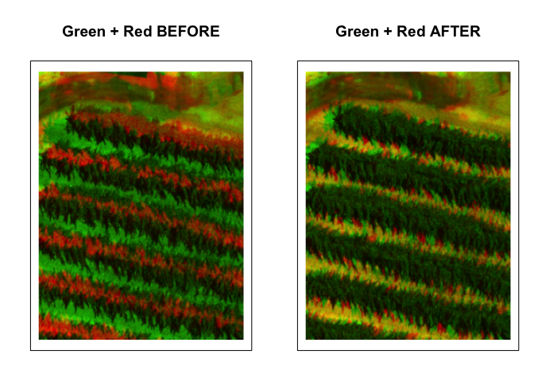

Feasibility of Drone Multispectral Image Coregistration Automation
================
Iris Nana Obeng
1-02-2026

# Report: Automatic Multispectral Image Coregistration

This document demonstrates the visual assessment of pre-aligned
multispectral drone imagery. It compares the original misaligned bands
to the aligned versions using false-color composites.

## 2. Methodology

### Objective: Test automatic band alignment without manual ground control points.

1.  Data Used Sensor: MicaSense RedEdge

    - Bands: Blue (475nm), Green (560nm), Red (668nm), NIR (840nm)

2.  Software R with terra package

    - Multispectral cameras capture different wavelength bands through
      separate lenses or sensors, creating spatial misalignment between
      bands.

``` r
# --- RAW (MISALIGNED) BANDS ---
raw_files <- list.files(pattern = "\\.tif$", full.names = TRUE)
ms <- rast(raw_files)
```

    ## Warning: [rast] unknown extent
    ## CRS do not match

``` r
# Convert to matrices
band_matrices <- lapply(1:nlyr(ms), function(i) as.matrix(ms[[i]], wide = TRUE))

# Names of the bands
band_names <- c("Blue", "Green", "Red", "NIR")
```

### Defining Alignment Functions

``` r
# Function to find best shift using correlation
align_band_simple <- function(ref_mat, target_mat, max_shift = 15) {
  best_cor <- -Inf
  best_dx <- 0
  best_dy <- 0
  rows <- nrow(ref_mat)
  cols <- ncol(ref_mat)
  
  for(dx in (-max_shift):max_shift) {
    for(dy in (-max_shift):max_shift) {
      shifted <- matrix(NA, nrow = rows, ncol = cols)
      dst_rows <- (1:rows) + dy
      dst_cols <- (1:cols) + dx
      
      rows_ok <- dst_rows >= 1 & dst_rows <= rows
      cols_ok <- dst_cols >= 1 & dst_cols <= cols
      
      if(any(rows_ok) && any(cols_ok)) {
        shifted[dst_rows[rows_ok], dst_cols[cols_ok]] <-
          target_mat[(1:rows)[rows_ok], (1:cols)[cols_ok]]
        
        overlap <- !is.na(ref_mat) & !is.na(shifted)
        if(sum(overlap) > 1000) {
          cor_val <- cor(ref_mat[overlap], shifted[overlap], use = "complete.obs")
          if(!is.na(cor_val) && cor_val > best_cor) {
            best_cor <- cor_val
            best_dx <- dx
            best_dy <- dy
          }
        }
      }
    }
  }
  return(list(dx = best_dx, dy = best_dy, cor = best_cor))
}

# Function to apply shift to a matrix
apply_shift <- function(mat, dx, dy) {
  rows <- nrow(mat)
  cols <- ncol(mat)
  shifted <- matrix(NA, nrow = rows, ncol = cols)
  dst_rows <- (1:rows) + dy
  dst_cols <- (1:cols) + dx
  
  rows_ok <- dst_rows >= 1 & dst_rows <= rows
  cols_ok <- dst_cols >= 1 & dst_cols <= cols
  
  shifted[dst_rows[rows_ok], dst_cols[cols_ok]] <-
    mat[(1:rows)[rows_ok], (1:cols)[cols_ok]]
  
  shifted
}
```

Explanation:

- The Green band is used as a reference.

- Each other band is shifted pixel-by-pixel to maximize correlation with
  Green.

- The best shifts are applied and stored in aligned_matrices.

### Aligning Bands to Green Reference

``` r
# Using Green (band 2) as reference
reference_index <- 2
ref_green <- band_matrices[[reference_index]]

aligned_matrices <- list()
aligned_matrices[[reference_index]] <- ref_green  # keep reference as-is
results <- list()

bands_to_align <- c(1, 3, 4)  # Blue, Red, NIR

for(i in bands_to_align) {
  message(paste("Aligning", band_names[i], "band to Green reference..."))
  result <- align_band_simple(ref_green, band_matrices[[i]], max_shift = 20)
  results[[band_names[i]]] <- result
  aligned_matrices[[i]] <- apply_shift(band_matrices[[i]], result$dx, result$dy)
  message(paste("  Shift dx =", result$dx, ", dy =", result$dy, ", correlation =", round(result$cor, 3)))
}
```

    ## Aligning Blue band to Green reference...

    ##   Shift dx = 20 , dy = -20 , correlation = 0.852

    ## Aligning Red band to Green reference...

    ##   Shift dx = 20 , dy = -15 , correlation = 0.781

    ## Aligning NIR band to Green reference...

    ##   Shift dx = -8 , dy = 0 , correlation = -0.035

### 2.1 Saving Aligned Bands as Raster Stack

Explanation:

- Converts aligned matrices back into a raster stack.

- Saves the aligned stack as MicaSense_4Band_Aligned.tif.

``` r
matrix_to_rast <- function(mat, name) {
  r <- rast(nrow = nrow(mat), ncol = ncol(mat))
  values(r) <- as.vector(t(mat))
  ext(r) <- c(0, ncol(mat), 0, nrow(mat))
  names(r) <- name
  r
}

aligned_rasters <- list()
for(i in 1:4) {
  aligned_rasters[[i]] <- matrix_to_rast(aligned_matrices[[i]], paste0(band_names[i], "_aligned"))
}

final_stack <- rast(aligned_rasters)
writeRaster(final_stack, "MicaSense_4Band_Aligned.tif", overwrite = TRUE)
```

### 2.2 Visualization Functions

The following code visualizes the alignment results by comparing
before/after states:

``` r
print("Generating comprehensive alignment visualization...")
```

    ## [1] "Generating comprehensive alignment visualization..."

``` r
# Helper function to crop center of matrix
center_crop <- function(mat, size = 300) {
  rows <- nrow(mat)
  cols <- ncol(mat)
  half <- floor(size / 2)
  mat[(rows/2-half):(rows/2+half),
      (cols/2-half):(cols/2+half)]
}

normalize <- function(x) {
  (x - min(x, na.rm = TRUE)) /
    (max(x, na.rm = TRUE) - min(x, na.rm = TRUE))
}
```

## 2.3 Extracting Individual Bands and Visualizing Alignment

``` r
# GREEN before and after alignment
green_before <- normalize(center_crop(band_matrices[[2]]))
green_after  <- normalize(center_crop(aligned_matrices[[2]]))

# RED before and after alignment
red_before <- normalize(center_crop(band_matrices[[3]]))
red_after  <- normalize(center_crop(aligned_matrices[[3]]))

# NIR before and after alignment
nir_before <- normalize(center_crop(band_matrices[[4]]))
nir_after  <- normalize(center_crop(aligned_matrices[[4]]))
```

### 2.4 Green-Red Alignment Visualization

``` r
rgb_gr_before <- array(0, dim = c(nrow(green_before),
                                  ncol(green_before), 3))
rgb_gr_before[,,1] <- red_before
rgb_gr_before[,,2] <- green_before

rgb_gr_after <- array(0, dim = c(nrow(green_after),
                                 ncol(green_after), 3))
rgb_gr_after[,,1] <- red_after
rgb_gr_after[,,2] <- green_after

par(mfrow = c(1,2), mar = c(2,2,4,1))

plot(c(0,1), c(0,1), type="n", axes=FALSE,
     main="Green + Red BEFORE")
rasterImage(rgb_gr_before, 0, 0, 1, 1); box()

plot(c(0,1), c(0,1), type="n", axes=FALSE,
     main="Green + Red AFTER")
rasterImage(rgb_gr_after, 0, 0, 1, 1); box()
```

<!-- -->

``` r
par(mfrow=c(1,1))
```

### 2.5 Green-NIR Alignment Visualization

``` r
rgb_gn_before <- array(0, dim=c(nrow(green_before),
                                  ncol(green_before), 3))
rgb_gn_before[,,2] <- green_before
rgb_gn_before[,,3] <- nir_before
rgb_gn_after <- array(0, dim=c(nrow(green_after),
                                 ncol(green_after), 3))
rgb_gn_after[,,2] <- green_after
rgb_gn_after[,,3] <- nir_after
par(mfrow=c(1,2), mar=c(2,2,4,1))
plot(c(0,1), c(0,1), type="n", axes=FALSE,
     main="Green + NIR BEFORE")
rasterImage(rgb_gn_before, 0,0,1,1); box()
plot(c(0,1), c(0,1), type="n", axes=FALSE,
     main="Green + NIR AFTER")
rasterImage(rgb_gn_after, 0,0,1,1); box()
```

<!-- -->

``` r
par(mfrow=c(1,1))
```

### 2.6 Alignment Visualization

``` r
# Mapping: NIR → R, Red → G, Green → B
rgb_grn_before <- array(0, dim=c(nrow(nir_before), ncol(nir_before), 3))
rgb_grn_before[,,1] <- nir_before
rgb_grn_before[,,2] <- red_before
rgb_grn_before[,,3] <- green_before

rgb_grn_after <- array(0, dim=c(nrow(nir_after), ncol(nir_after), 3))
rgb_grn_after[,,1] <- nir_after
rgb_grn_after[,,2] <- red_after
rgb_grn_after[,,3] <- green_after

par(mfrow=c(1,2), mar=c(2,2,4,1))
plot(c(0,1), c(0,1), type="n", axes=FALSE,
     main="Green+Red+NIR BEFORE")
rasterImage(rgb_grn_before, 0,0,1,1); box()
plot(c(0,1), c(0,1), type="n", axes=FALSE,
     main="Green+Red+NIR AFTER")
rasterImage(rgb_grn_after, 0,0,1,1); box()
```

<!-- -->

``` r
par(mfrow=c(1,1))
```

3.  Summary

- This script loads raw and pre-aligned multispectral bands.
- Crops and normalizes each band for visual assessment.
- Generates side-by-side false-color composites to compare before and
  after alignment.
- Visual inspection confirms improved color consistency and reduced
  misalignment in the “after” images.

Bands used in this study:

      IMG_0455_1.tif → Blue (475nm)

      IMG_0455_2.tif → Green (560nm)

      IMG_0455_3.tif → Red (668nm)

      IMG_0455_4.tif → NIR (840nm)

This document presents the visualization and assessment of automatic
multispectral image co-registration.
